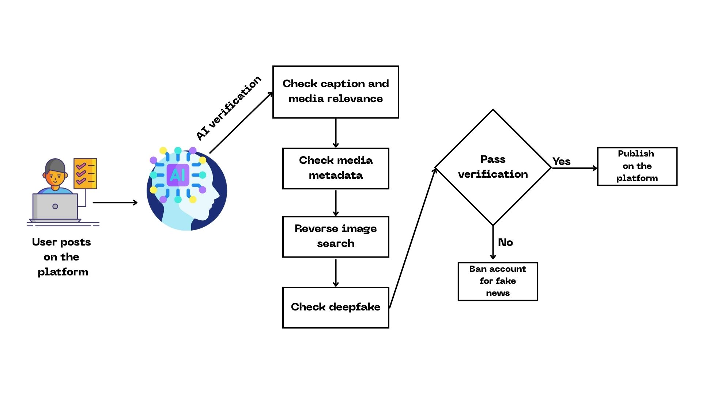

# নাগরিক সংবাদ (Nagorik Songbad)

**AI-verified citizen journalism for Bangladesh**

Nagorik Songbad is a full-stack, production-ready platform that empowers citizens to publish news responsibly. Every submission passes through our AI-powered verification pipeline before it reaches the nationwide feed, ensuring unmatched transparency and trust.



---

## 📋 Table of Contents

- [Welcome](#welcome)
- [Key Features](#key-features)
- [How It Works](#how-it-works)
- [System Architecture](#system-architecture)
- [Technology Stack](#technology-stack)
- [Installation](#installation)
- [Usage Guide](#usage-guide)
- [Points & Rewards](#points--rewards)
- [Security](#security)
- [Contributing](#contributing)
- [License](#license)
- [Contact](#contact)

---

## 🎯 Welcome

Nagorik Songbad is Bangladesh’s first AI-verified citizen journalism network. Our mission is to safeguard truth, empower responsible citizen reporters, and deter misinformation through automation and community incentives.

### Mission Pillars

- **Truth at scale** – Automated AI verification for every submission.
- **Citizen empowerment** – Intuitive tools for reporting incidents with media attachments.
- **Misinformation defense** – Deepfake detection, metadata analysis, and reverse search.
- **Community rewards** – A gamified leaderboard culminating in the Brave Citizen Award.

---

## ✨ Key Features

### 1. AI Verification Pipeline

- **Caption–media correlation** to catch mismatched narratives.
- **Metadata forensics** to inspect camera time, GPS, and device traces.
- **Reverse search engines** to discover prior usage of media assets.
- **Deepfake detection** leveraging industry-leading APIs.

### 2. User & Identity Management

- Secure registration & login flows.
- Personalized profile dashboards (posts, stats, points).
- Full leaderboard for nationwide ranking.

### 3. News Publishing Suite

- Rich text captions with media upload (photo/video).
- Real-time AI verification modal showing progress.
- Verified feed featuring only approved stories.

### 4. Gamified Rewards

- Automatic point accrual (10 points per verified story).
- Persistent leaderboard tracking contributions.
- Year-end **Brave Citizen Award** for the top-ranked journalist.

---

## 🔄 How It Works

1. **Submit a story** – Caption + media via the feed console.
2. **AI verification** – Automated checks for integrity, originality, and authenticity.
3. **Publish or reject** – Verified stories go live with badges; fraudulent attempts trigger enforcement.

---

## 🏗️ System Architecture

Nagorik Songbad follows a modular, cloud-native architecture built for national scale.


### Core Components

1. **Frontend Experience**
   - Next.js 16 App Router
   - Real-time feed, profile, leaderboard, auth flows
2. **API Gateway**
   - REST endpoints for auth, posts, scoring, analytics
3. **Authentication Service**
   - JWT-based session management, role-based access
4. **AI Verification Mesh**
   - Caption–media matcher
   - Metadata analyzer
   - Reverse search workers
   - Deepfake detection adapters
5. **Data Tier**
   - User directory
   - Verified news ledger
   - Leaderboard + telemetry DBs
6. **Object Storage**
   - Secure media storage with CDN delivery
7. **Notification & Orchestration**
   - WebSocket/SSE updates
   - Background jobs for verification queues

---

## 💻 Technology Stack

### Frontend

- **Framework:** Next.js 16 (App Router)
- **Language:** TypeScript + React 19
- **Styling:** Tailwind CSS 4, custom design tokens
- **Font:** Noto Sans Bengali (native Bengali typography)

### Backend & AI Services

- REST microservices (Node & Python workers)
- NLP + Computer Vision pipelines
- Third-party deepfake detection APIs
- Hybrid relational + NoSQL persistence

### Infrastructure

- Containerized deployments (Kubernetes)
- Global CDN for static + media assets
- Centralized logging, metrics, and alerting

---

## 🚀 Installation

> Production deployments run as multi-service clusters. The steps below boot the full-featured preview locally.

### Prerequisites

- Node.js 18+
- npm / yarn / pnpm / bun

### Setup

```bash
git clone <repository-url>
cd nagorik-songbad
npm install            # or yarn / pnpm / bun install
cp .env.example .env   # configure API keys, storage buckets, etc.
npm run dev            # start development environment
```

Visit `http://localhost:3000` to access the experience.

---

## 📖 Usage Guide

### New Reporters

1. Register with name, email, and password.
2. Complete profile onboarding (avatar auto-generated).
3. Login to access the feed console.

### Publishing News

1. Navigate to the **Feed** page.
2. Draft a caption, attach optional photo/video.
3. Submit the story and watch the AI verification modal.
4. Upon approval, your story appears in the verified feed and points are awarded automatically.

### Tracking Progress

- **Profile:** View personal stats, post history, cumulative points.
- **Leaderboard:** Compare rankings nationwide, monitor Brave Citizen race.

---

## 🏆 Points & Rewards

| Action                         | Points |
|-------------------------------|--------|
| Verified story publication    | +10    |
| Top weekly contributor badge  | +25    |
| Year-end Brave Citizen winner | Trophy + spotlight |

- The leaderboard updates in real time.
- Points never expire; annual totals decide the Brave Citizen Award recipient.

---

## 🔒 Security

### User Safeguards

- Encrypted credentials with salted hashing.
- OAuth2-compatible token lifecycle.
- Rigorous device/session tracking.

### Content Integrity

- AI moderation for every submission.
- Automated deepfake and tampering detection.
- Audit trails for all verification outcomes.

### Data Protection

- GDPR-compliant data handling.
- Continuous backups & disaster recovery.
- Role-based access control across services.

---


## 📄 License

Nagorik Songbad is distributed under the [MIT License](./LICENSE). See the license file for details.

---


**Nagorik Songbad – Citizen voices for the truth.**
